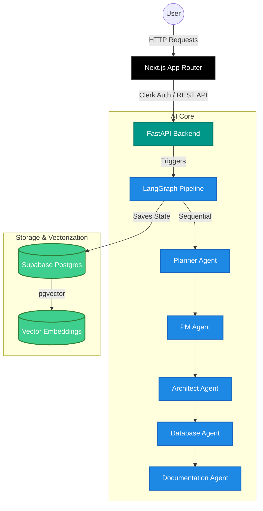
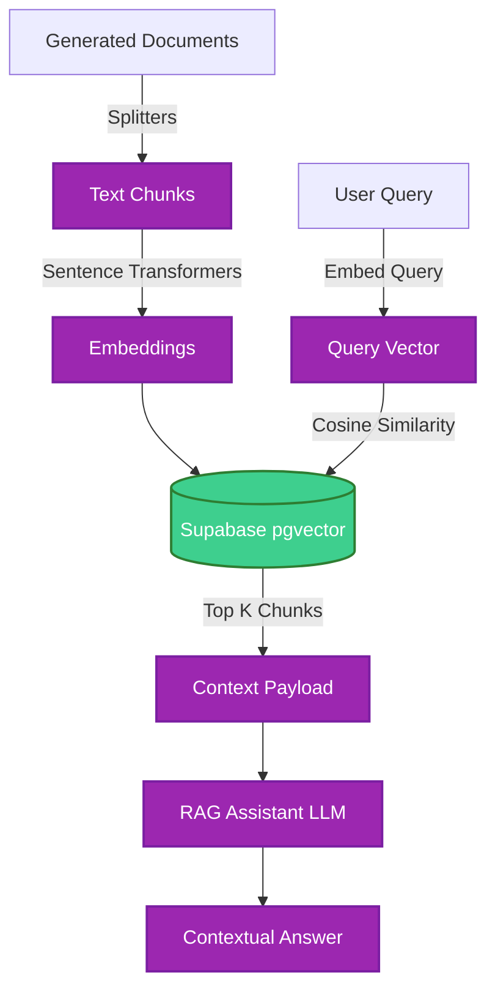
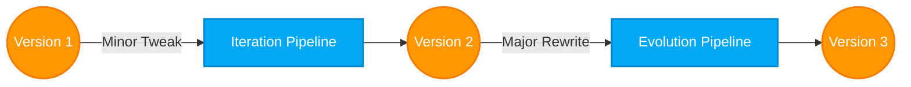
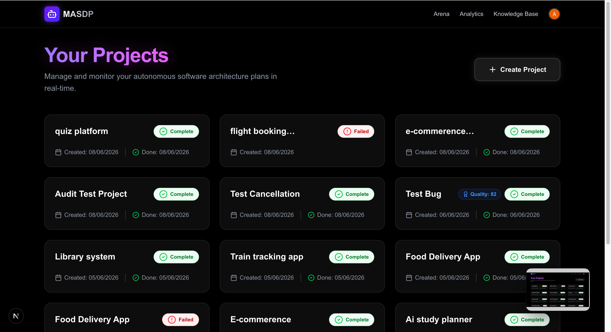
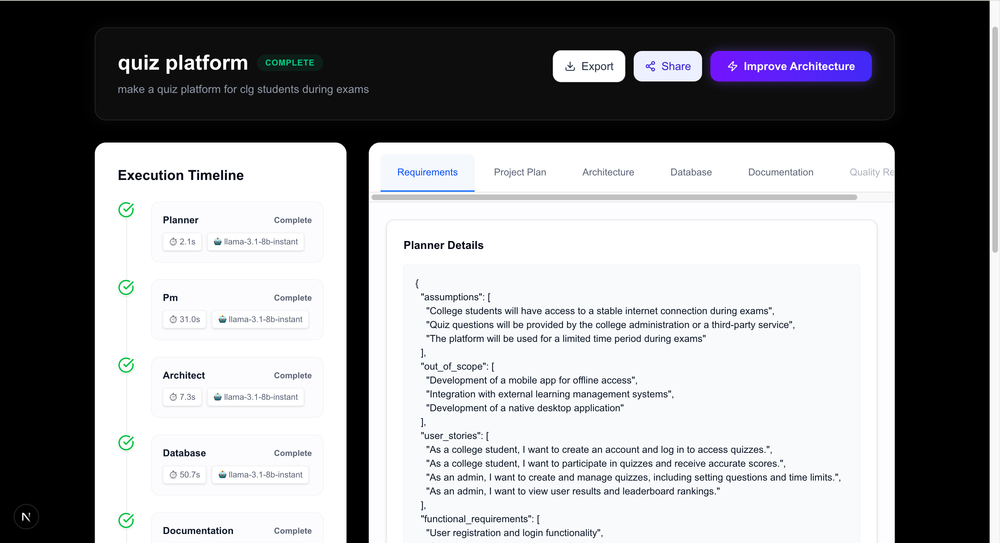
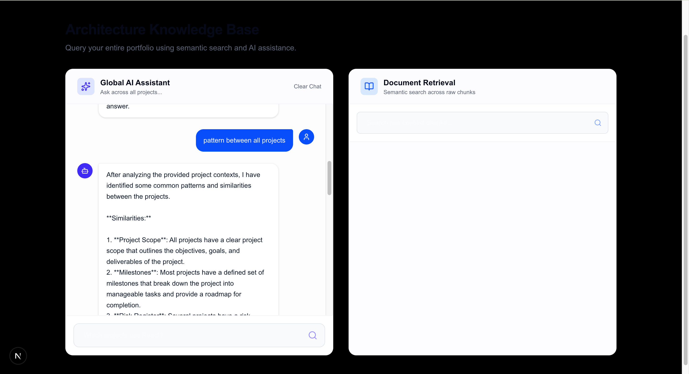
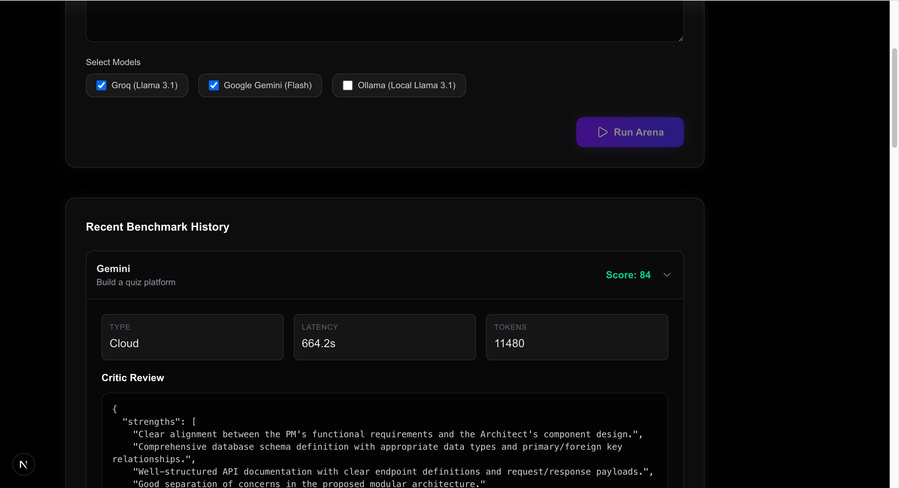

<div align="center">
  <h1>🚀 MASDP</h1>
  <p><strong>Multi-Agent Software Design Platform</strong></p>
  <p>Transform any software idea into a complete planning package — requirements, architecture, database schema, and documentation — powered by specialized AI agents.</p>

  [](#)
  [](#)
  [](#)
  [](#)
  [](#)
</div>

<br />

## 🌟 Overview

MASDP is a full-stack AI platform that simulates an entire elite software development team. You describe your project idea in plain English, and 5 specialized AI agents collaborate using a **LangGraph StateGraph** to produce:

- **📋 Planner Agent:** Functional/non-functional requirements and user stories
- **🗓 PM Agent:** Scope, milestones, risks, and acceptance criteria
- **🏗 Architect Agent:** System design, tech stack, and component architecture
- **🗃 Database Agent:** Normalized tables, ER diagrams, and SQL DDL
- **📄 Documentation Agent:** README, API docs, setup guides, and roadmaps

---

## 🏛 System Architecture

The MASDP platform consists of a highly responsive Next.js frontend, a FastAPI backend executing LangGraph agent state machines, and a Supabase PostgreSQL database storing vector embeddings and analytics.



---

## ✨ Features

- **Multi-Agent Pipeline**: 5 specialized agents that pass and refine context sequentially.
- **Project Versioning**: Snapshot and rollback project architectures effortlessly.
- **Iteration Engine**: Use AI to refine and iterate on specific generated components.
- **Evolution Engine**: Perform massive architectural overhauls safely.
- **RAG Project Assistant**: Chat with your generated architecture using vector similarity search.
- **Export System**: Export full proposals to PDF, JSON, Markdown, and PPTX.
- **Share Links**: Generate secure, read-only links for stakeholders.
- **Arena Evaluation**: Benchmark different LLM providers (Groq, Gemini, Ollama) against your projects.
- **Analytics Dashboard**: Track RAG metrics, common weaknesses, and provider latencies.

---

## 💻 Tech Stack

| Layer | Technology | Purpose |
|-------|-----------|---------|
| **Frontend** | Next.js 15, Tailwind CSS, ShadCN | Reactive UI, Server Components |
| **Backend** | FastAPI, Python 3.13, Uvicorn | High-performance async API |
| **AI Orchestration** | LangGraph, LangChain | State machine for multi-agent workflows |
| **LLMs** | Groq, Gemini, Ollama | Lightning fast inference (Groq default) |
| **Database** | Supabase, PostgreSQL, pgvector | Auth, relational data, and RAG embeddings |
| **Authentication** | Clerk | Secure, scalable user management |

---

## 🚀 RAG (Retrieval-Augmented Generation) Flow

MASDP features a context-aware chat assistant that lets users talk to their generated architecture.



---

## 🔄 Versioning & Evolution Flow

Never lose your past designs. Projects can be evolved incrementally or drastically.



---

## 📂 Folder Structure

```text
masdp/
├── frontend/                 # Next.js Application
│   ├── src/app/              # App Router pages
│   ├── src/components/       # UI Components (Shadcn)
│   └── src/lib/              # Utils and API clients
├── backend/                  # FastAPI Application
│   ├── app/                  # REST API & DB clients
│   ├── agents/               # LangGraph Nodes & State
│   └── prompts/              # System Prompts for Agents
├── database/                 # Supabase SQL Migrations
└── docs/                     # Documentation
```

---

## 📸 Screenshots

*(Please save the uploaded screenshots into the `docs/screenshots/` directory with the matching filenames below)*

| Dashboard | Architecture View |
|:---:|:---:|
|  |  |

| RAG Chat Assistant | Evaluation Arena |
|:---:|:---:|
|  |  |

---

## 🛠 Installation & Local Setup

### 1. Clone the repository
```bash
git clone https://github.com/yourusername/masdp.git
cd masdp
```

### 2. Backend Setup
```bash
cd backend
python -m venv .venv
source .venv/bin/activate
pip install -r requirements.txt
uvicorn app.main:app --reload --port 8000
```

### 3. Frontend Setup
```bash
cd frontend
npm install
npm run dev
```

---

## 🔑 Environment Variables

To run the project, you must create `.env.local` files in both directories.

### `frontend/.env.local`
```env
NEXT_PUBLIC_API_URL=http://localhost:8000
NEXT_PUBLIC_CLERK_PUBLISHABLE_KEY=pk_test_...
CLERK_SECRET_KEY=sk_test_...
NEXT_PUBLIC_CLERK_SIGN_IN_URL=/sign-in
NEXT_PUBLIC_CLERK_SIGN_UP_URL=/sign-up
NEXT_PUBLIC_CLERK_AFTER_SIGN_IN_URL=/dashboard
NEXT_PUBLIC_CLERK_AFTER_SIGN_UP_URL=/dashboard
```

### `backend/.env`
```env
SUPABASE_URL=https://your-project.supabase.co
SUPABASE_SERVICE_ROLE_KEY=your-service-role-key
GROQ_API_KEY=gsk_...
GEMINI_API_KEY=...
```

---

## 🗺 Roadmap

- [x] Core 5-Agent Pipeline
- [x] Project Versioning & Iteration
- [x] Context-Aware Architecture Chat (RAG)
- [x] Multi-format Exports


---

## 🤝 Contributing

Contributions are welcome! Please follow these steps:
1. Fork the repository.
2. Create a feature branch (`git checkout -b feature/AmazingFeature`).
3. Commit your changes (`git commit -m 'Add some AmazingFeature'`).
4. Push to the branch (`git push origin feature/AmazingFeature`).
5. Open a Pull Request.

---

## 📄 License

Distributed under the MIT License. See `LICENSE` for more information.
